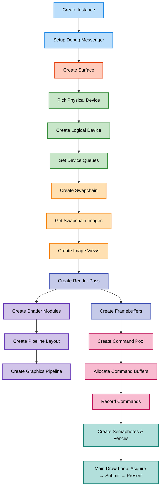

```mermaid
flowchart TD
    %% Instance Layer
    A[Create Instance]
    A --> B[Setup Debug Messenger]

    %% Surface Layer
    B --> C[Create Surface]

    %% Device Layer
    C --> D[Pick Physical Device]
    D --> E[Create Logical Device]
    E --> F[Get Device Queues]

    %% Swapchain Layer
    F --> G[Create Swapchain]
    G --> H[Get Swapchain Images]
    H --> I[Create Image Views]

    %% Render Pass and Framebuffer
    I --> J[Create Render Pass]
    J --> K[Create Framebuffers]

    %% Pipeline Layer
    J --> L[Create Shader Modules]
    L --> M[Create Pipeline Layout]
    M --> N[Create Graphics Pipeline]

    %% Command Buffers and Drawing
    K --> O[Create Command Pool]
    O --> P[Allocate Command Buffers]
    P --> Q[Record Commands]

    %% Synchronization and Drawing Loop
    Q --> R[Create Semaphores & Fences]
    R --> S[Main Draw Loop: Acquire → Submit → Present]

    %% Labels for conceptual groups
    classDef instance fill:#bbdefb,stroke:#1e88e5,stroke-width:2px,color:#000000;
    classDef device fill:#c8e6c9,stroke:#388e3c,stroke-width:2px,color:#000000;
    classDef swapchain fill:#ffe0b2,stroke:#f57c00,stroke-width:2px,color:#000000;
    classDef pipeline fill:#d1c4e9,stroke:#673ab7,stroke-width:2px,color:#000000;
    classDef commands fill:#f8bbd0,stroke:#c2185b,stroke-width:2px,color:#000000;
    classDef sync fill:#b2dfdb,stroke:#00796b,stroke-width:2px,color:#000000;
    classDef surface fill:#ffccbc,stroke:#e64a19,stroke-width:2px,color:#000000;
    classDef renderpass fill:#c5cae9,stroke:#3f51b5,stroke-width:2px,color:#000000;

    class A,B instance;
    class C surface;
    class D,E,F device;
    class G,H,I swapchain;
    class J,K renderpass;
    class L,M,N pipeline;
    class O,P,Q commands;
    class R,S sync;

```