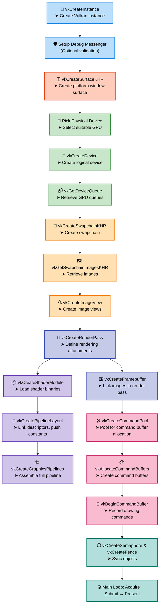

```mermaid
flowchart TD
    %% Instance Layer
    A1["🔌 vkCreateInstance<br>➤ Create Vulkan instance"]:::instance
    A2["🛡️ Setup Debug Messenger<br>(Optional validation)"]:::instance

    %% Surface Layer
    B1["🪟 vkCreateSurfaceKHR<br>➤ Create platform window surface"]:::surface

    %% Device Layer
    C1["🎯 Pick Physical Device<br>➤ Select suitable GPU"]:::device
    C2["🔧 vkCreateDevice<br>➤ Create logical device"]:::device
    C3["📬 vkGetDeviceQueue<br>➤ Retrieve GPU queues"]:::device

    %% Swapchain Layer
    D1["🔁 vkCreateSwapchainKHR<br>➤ Create swapchain"]:::swapchain
    D2["🖼️ vkGetSwapchainImagesKHR<br>➤ Retrieve images"]:::swapchain
    D3["🔍 vkCreateImageView<br>➤ Create image views"]:::swapchain

    %% Render Pass and Framebuffers
    E1["🎨 vkCreateRenderPass<br>➤ Define rendering attachments"]:::renderpass
    E2["🖼️ vkCreateFramebuffer<br>➤ Link images to render pass"]:::renderpass

    %% Pipeline Layer
    F1["📦 vkCreateShaderModule<br>➤ Load shader binaries"]:::pipeline
    F2["🧩 vkCreatePipelineLayout<br>➤ Link descriptors, push constants"]:::pipeline
    F3["🏗️ vkCreateGraphicsPipelines<br>➤ Assemble full pipeline"]:::pipeline

    %% Command Buffers and Drawing
    G1["🛠️ vkCreateCommandPool<br>➤ Pool for command buffer allocation"]:::commands
    G2["📋 vkAllocateCommandBuffers<br>➤ Create command buffers"]:::commands
    G3["📝 vkBeginCommandBuffer<br>➤ Record drawing commands"]:::commands

    %% Sync and Draw Loop
    H1["⏱️ vkCreateSemaphore & vkCreateFence<br>➤ Sync objects"]:::sync
    H2["🎬 Main Loop: Acquire → Submit → Present"]:::sync

    %% Links
    A1 --> A2 --> B1
    B1 --> C1 --> C2 --> C3
    C3 --> D1 --> D2 --> D3
    D3 --> E1 --> E2
    E1 --> F1 --> F2 --> F3
    E2 --> G1 --> G2 --> G3
    G3 --> H1 --> H2

    %% Styling
    classDef instance fill:#bbdefb,stroke:#1e88e5,stroke-width:2px,color:#000;
    classDef surface fill:#ffccbc,stroke:#e64a19,stroke-width:2px,color:#000;
    classDef device fill:#c8e6c9,stroke:#388e3c,stroke-width:2px,color:#000;
    classDef swapchain fill:#ffe0b2,stroke:#f57c00,stroke-width:2px,color:#000;
    classDef renderpass fill:#c5cae9,stroke:#3f51b5,stroke-width:2px,color:#000;
    classDef pipeline fill:#d1c4e9,stroke:#673ab7,stroke-width:2px,color:#000;
    classDef commands fill:#f8bbd0,stroke:#c2185b,stroke-width:2px,color:#000;
    classDef sync fill:#b2dfdb,stroke:#00796b,stroke-width:2px,color:#000;


```