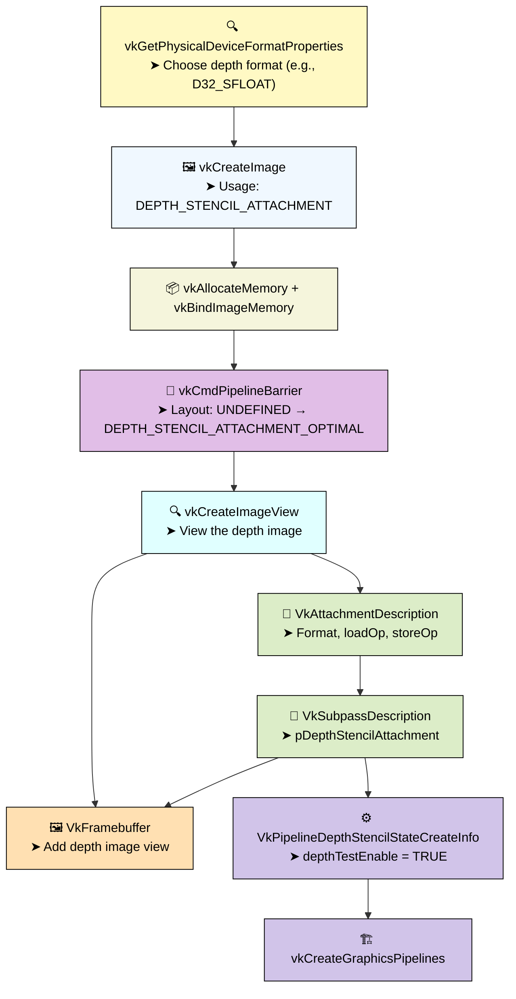

```mermaid
flowchart TD
    %% Format Selection
    A1["🔍 vkGetPhysicalDeviceFormatProperties<br>➤ Choose depth format (e.g., D32_SFLOAT)"]:::query

    %% Depth Image Creation
    B1["🖼️ vkCreateImage<br>➤ Usage: DEPTH_STENCIL_ATTACHMENT"]:::image
    B2["📦 vkAllocateMemory + vkBindImageMemory"]:::memory
    B3["🔄 vkCmdPipelineBarrier<br>➤ Layout: UNDEFINED → DEPTH_STENCIL_ATTACHMENT_OPTIMAL"]:::barrier

    %% Image View
    C1["🔍 vkCreateImageView<br>➤ View the depth image"]:::view

    %% Render Pass
    D1["🧱 VkAttachmentDescription<br>➤ Format, loadOp, storeOp"]:::rp
    D2["🧩 VkSubpassDescription<br>➤ pDepthStencilAttachment"]:::rp

    %% Framebuffer
    E1["🖼️ VkFramebuffer<br>➤ Add depth image view"]:::fb

    %% Pipeline Config
    F1["⚙️ VkPipelineDepthStencilStateCreateInfo<br>➤ depthTestEnable = TRUE"]:::pipeline
    F2["🏗️ vkCreateGraphicsPipelines"]:::pipeline

    %% Flow Connections
    A1 --> B1 --> B2 --> B3 --> C1 --> E1
    C1 --> D1 --> D2 --> E1
    D2 --> F1 --> F2

    %% Styling
    classDef query fill:#fff9c4,stroke:#000,color:#000;
    classDef image fill:#f0f8ff,stroke:#000,color:#000;
    classDef memory fill:#f5f5dc,stroke:#000,color:#000;
    classDef barrier fill:#e1bee7,stroke:#000,color:#000;
    classDef view fill:#e0ffff,stroke:#000,color:#000;
    classDef rp fill:#dcedc8,stroke:#000,color:#000;
    classDef fb fill:#ffe0b2,stroke:#000,color:#000;
    classDef pipeline fill:#d1c4e9,stroke:#000,color:#000;
```