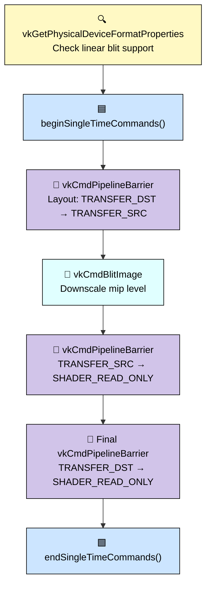

```mermaid
flowchart TD
    %% Validation
    A1["🔍 vkGetPhysicalDeviceFormatProperties<br>Check linear blit support"]:::check

    %% Begin Commands
    B1["🟦 beginSingleTimeCommands()"]:::command

    %% Mipmap Loop (repeats for each level)
    C1["🔄 vkCmdPipelineBarrier<br>Layout: TRANSFER_DST → TRANSFER_SRC"]:::barrier
    C2["📐 vkCmdBlitImage<br>Downscale mip level"]:::blit
    C3["🔄 vkCmdPipelineBarrier<br>TRANSFER_SRC → SHADER_READ_ONLY"]:::barrier

    %% Final Level Transition
    D1["🧱 Final vkCmdPipelineBarrier<br>TRANSFER_DST → SHADER_READ_ONLY"]:::barrier

    %% End Command Buffer
    E1["🟩 endSingleTimeCommands()"]:::command

    %% Flow
    A1 --> B1 --> C1 --> C2 --> C3 --> D1 --> E1

    %% Styling
    classDef check fill:#fff9c4,stroke:#000,color:#000;
    classDef command fill:#cce5ff,stroke:#000,color:#000;
    classDef barrier fill:#d1c4e9,stroke:#000,color:#000;
    classDef blit fill:#e0ffff,stroke:#000,color:#000;

```