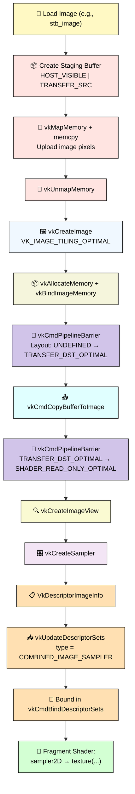

```mermaid
flowchart TD
    %% Load and Staging
    A1["🧾 Load Image (e.g., stb_image)"]:::load
    A2["📦 Create Staging Buffer<br>HOST_VISIBLE | TRANSFER_SRC"]:::staging
    A3["📝 vkMapMemory + memcpy<br>Upload image pixels"]:::staging
    A4["🚫 vkUnmapMemory"]:::staging

    %% GPU Image Creation
    B1["🖼️ vkCreateImage<br>VK_IMAGE_TILING_OPTIMAL"]:::image
    B2["📦 vkAllocateMemory + vkBindImageMemory"]:::memory
    B3["🔄 vkCmdPipelineBarrier<br>Layout: UNDEFINED → TRANSFER_DST_OPTIMAL"]:::barrier

    %% Image Copy
    C1["📤 vkCmdCopyBufferToImage"]:::transfer
    C2["🔄 vkCmdPipelineBarrier<br>TRANSFER_DST_OPTIMAL → SHADER_READ_ONLY_OPTIMAL"]:::barrier

    %% Shader Access
    D1["🔍 vkCreateImageView"]:::view
    D2["🎛️ vkCreateSampler"]:::sampler

    %% Descriptor Setup
    E1["📋 VkDescriptorImageInfo"]:::descriptor
    E2["📥 vkUpdateDescriptorSets<br>type = COMBINED_IMAGE_SAMPLER"]:::descriptor
    E3["🧬 Bound in vkCmdBindDescriptorSets"]:::descriptor

    %% Shader
    F1["🧾 Fragment Shader:<br>sampler2D → texture(...)"]:::shader

    %% Flow
    A1 --> A2 --> A3 --> A4 --> B1 --> B2 --> B3 --> C1 --> C2 --> D1 --> D2
    D2 --> E1 --> E2 --> E3 --> F1

    %% Styling
    classDef load fill:#fff9c4,stroke:#000,color:#000;
    classDef staging fill:#ffe4e1,stroke:#000,color:#000;
    classDef image fill:#f0f8ff,stroke:#000,color:#000;
    classDef memory fill:#f5f5dc,stroke:#000,color:#000;
    classDef barrier fill:#d1c4e9,stroke:#000,color:#000;
    classDef transfer fill:#e0ffff,stroke:#000,color:#000;
    classDef view fill:#fafad2,stroke:#000,color:#000;
    classDef sampler fill:#f3e5f5,stroke:#000,color:#000;
    classDef descriptor fill:#ffe0b2,stroke:#000,color:#000;
    classDef shader fill:#d3ffd3,stroke:#000,color:#000;

```