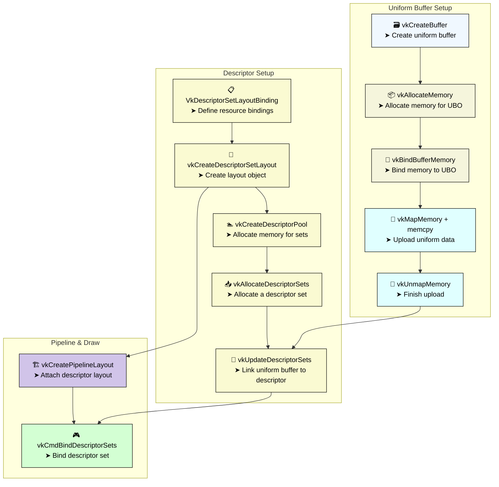

```mermaid
flowchart TD
    %% Uniform Buffer Setup
    subgraph Uniform Buffer Setup
        U1["🗃️ vkCreateBuffer<br>➤ Create uniform buffer"]:::buffer
        U2["📦 vkAllocateMemory<br>➤ Allocate memory for UBO"]:::memory
        U3["🔗 vkBindBufferMemory<br>➤ Bind memory to UBO"]:::memory
        U4["📝 vkMapMemory + memcpy<br>➤ Upload uniform data"]:::upload
        U5["🚫 vkUnmapMemory<br>➤ Finish upload"]:::upload
    end

    %% Descriptor Setup
    subgraph Descriptor Setup
        D1["📋 VkDescriptorSetLayoutBinding<br>➤ Define resource bindings"]:::desc
        D2["📐 vkCreateDescriptorSetLayout<br>➤ Create layout object"]:::desc
        D3["🏊 vkCreateDescriptorPool<br>➤ Allocate memory for sets"]:::desc
        D4["📥 vkAllocateDescriptorSets<br>➤ Allocate a descriptor set"]:::desc
        D5["🔗 vkUpdateDescriptorSets<br>➤ Link uniform buffer to descriptor"]:::desc
    end

    %% Pipeline & Binding
    subgraph Pipeline & Draw
        P1["🏗️ vkCreatePipelineLayout<br>➤ Attach descriptor layout"]:::pipeline
        P2["🎮 vkCmdBindDescriptorSets<br>➤ Bind descriptor set"]:::draw
    end

    %% Flow Links
    U1 --> U2 --> U3 --> U4 --> U5 --> D5
    D1 --> D2 --> D3 --> D4 --> D5
    D2 --> P1 --> P2
    D5 --> P2

    %% Styles
    classDef buffer fill:#f0f8ff,stroke:#000,color:#000;
    classDef memory fill:#f5f5dc,stroke:#000,color:#000;
    classDef upload fill:#e0ffff,stroke:#000,color:#000;
    classDef desc fill:#fafad2,stroke:#000,color:#000;
    classDef pipeline fill:#d1c4e9,stroke:#000,color:#000;
    classDef draw fill:#d3ffd3,stroke:#000,color:#000;

```