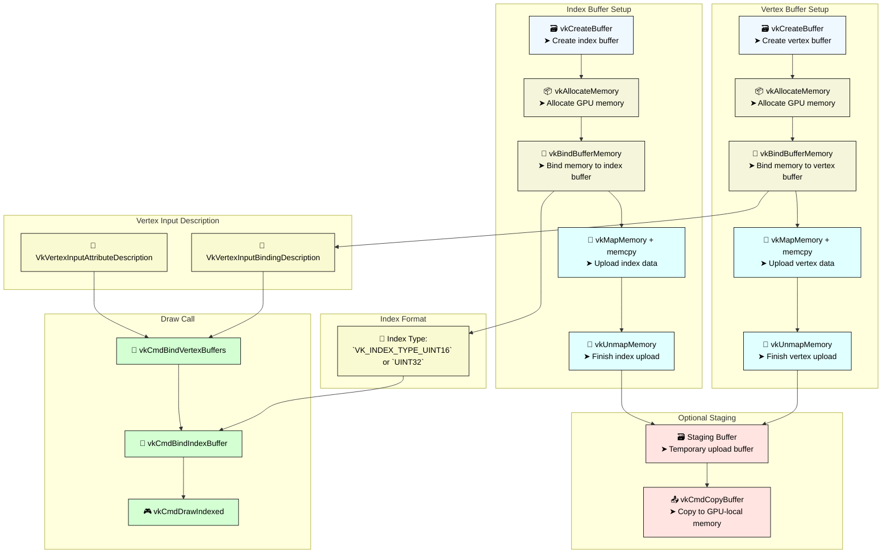

```mermaid
flowchart TD
    %% Vertex Buffer Upload
    subgraph Vertex Buffer Setup
        V1["🗃️ vkCreateBuffer<br>➤ Create vertex buffer"]:::buffer
        V2["📦 vkAllocateMemory<br>➤ Allocate GPU memory"]:::memory
        V3["🔗 vkBindBufferMemory<br>➤ Bind memory to vertex buffer"]:::memory
        V4["📝 vkMapMemory + memcpy<br>➤ Upload vertex data"]:::upload
        V5["🚫 vkUnmapMemory<br>➤ Finish vertex upload"]:::upload
    end

    %% Index Buffer Upload
    subgraph Index Buffer Setup
        I1["🗃️ vkCreateBuffer<br>➤ Create index buffer"]:::buffer
        I2["📦 vkAllocateMemory<br>➤ Allocate GPU memory"]:::memory
        I3["🔗 vkBindBufferMemory<br>➤ Bind memory to index buffer"]:::memory
        I4["📝 vkMapMemory + memcpy<br>➤ Upload index data"]:::upload
        I5["🚫 vkUnmapMemory<br>➤ Finish index upload"]:::upload
    end

    %% Optional Staging
    subgraph Optional Staging
        S1["🗃️ Staging Buffer<br>➤ Temporary upload buffer"]:::staging
        S2["📤 vkCmdCopyBuffer<br>➤ Copy to GPU-local memory"]:::staging
    end

    %% Vertex Input Description
    subgraph Vertex Input Description
        D1["📏 VkVertexInputBindingDescription"]:::desc
        D2["🎯 VkVertexInputAttributeDescription"]:::desc
    end

    %% Index Format
    subgraph Index Format
        F1["🔢 Index Type:<br>`VK_INDEX_TYPE_UINT16` or `UINT32`"]:::desc
    end

    %% Draw Call
    subgraph Draw Call
        B1["🔗 vkCmdBindVertexBuffers"]:::draw
        B2["🔗 vkCmdBindIndexBuffer"]:::draw
        B3["🎮 vkCmdDrawIndexed"]:::draw
    end

    %% Flow Links
    V1 --> V2 --> V3 --> V4 --> V5 --> S1
    I1 --> I2 --> I3 --> I4 --> I5 --> S1
    S1 --> S2

    V3 --> D1 --> B1
    D2 --> B1

    I3 --> F1 --> B2
    B1 --> B2 --> B3

    %% Styling
    classDef buffer fill:#f0f8ff,stroke:#000,color:#000;
    classDef memory fill:#f5f5dc,stroke:#000,color:#000;
    classDef upload fill:#e0ffff,stroke:#000,color:#000;
    classDef staging fill:#ffe4e1,stroke:#000,color:#000;
    classDef desc fill:#fafad2,stroke:#000,color:#000;
    classDef draw fill:#d3ffd3,stroke:#000,color:#000;

```